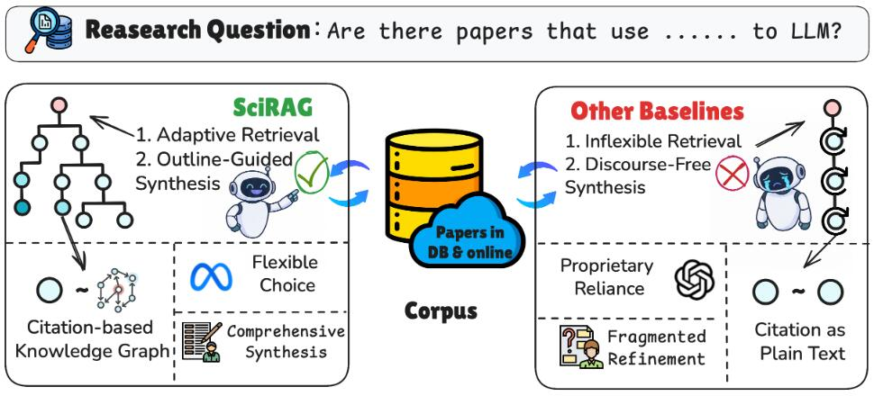
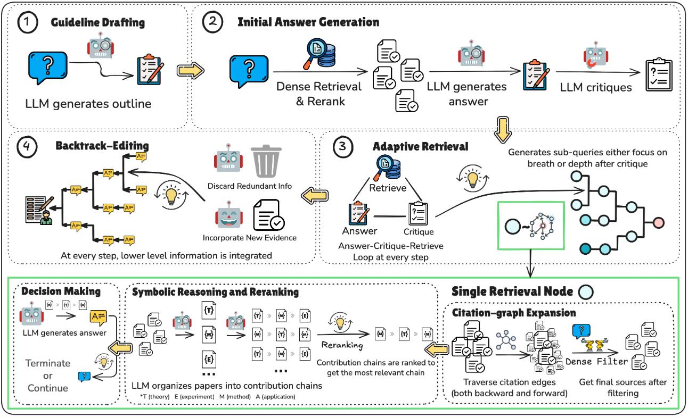

<div align="center">

# SciRAG: Adaptive, Citation-Aware, and Outline-Guided Retrieval and Synthesis for Scientific Literature

[](https://arxiv.org/pdf/xxxx)

</div>

## 📖 Overview

<div align="center">
  
</div>

Existing baseline approaches for scientific question answering follow a single-threaded iterative retrieval strategy, limiting their ability to comprehensively address multi-faceted questions and leading to incomplete coverage and answer organization. 

**SciRAG** addresses these limitations through a novel framework with three key capabilities:

- **Adaptive Retrieval**: A Gap Critic mechanism automatically determines when additional retrieval is needed and uses tree-based query decomposition to enable parallel or sequential exploration of sub-questions, with citation graph expansion to enrich the retrieved paper set.
- **Symbolic Reasoning-Based Reranking**: A three-step symbolic reasoning process analyzes paper relationships and contributions to intelligently rerank retrieved documents.
- **Outline-Guided Synthesis**: Answers are synthesized through bottom-up aggregation along the query tree, guided by a structured outline to ensure comprehensive coverage and proper organization.

SciRAG achieves strong performance across both long-form literature review tasks (ScholarQA, QASA) and short-form answer tasks (SciFact, PubMedQA), demonstrating superior answer quality compared to existing baselines.


## 🏗️ Framework

<div align="center">
  
</div>

## 🚀 Quickstart

### 📦 Installation

Create and activate the conda environment:

```bash
conda env create -f environment.yml
conda activate scirag
```

**Remember to configure your API keys:**
- Set your **Semantic Scholar API key** in `web_search.py`
- Set your **LLM API key** in `config.yaml`

### ▶️ Running the Pipeline

For **long-form answers** (ScholarQA, QASA):

```bash
cd longans
python run.py --input_file test.jsonl --output_file testout.jsonl --model_name gpt4o
```

For **short-form answers** (SciFact, PubMedQA):

```bash
cd shortans/scifact  # or shortans/pubmed
python run.py --input_file test.jsonl --output_file testout.jsonl --model_name gpt4o
```

### 🔍 Initial Dense Retrieval

Since dense retrieval from a large-scale corpus (45 million papers) can be resource-intensive, we recommend following the retrieval method from:

**[OpenScholar Retriever](https://github.com/AkariAsai/OpenScholar/tree/main/retriever)**

This helps reduce the heavy resource cost during retrieval. Once retrieved, you can use the output file as the input to the SciRAG pipeline.

### 📊 Evaluation

For evaluation tools and benchmarks, please refer to:

**[ScholarQABench](https://github.com/AkariAsai/ScholarQABench/tree/main)**


## ✍️ Citation
If you use our work and are inspired by our work, please consider cite us:
```
@misc{zhao2025mmvu,
      title={SciRAG: Adaptive, Citation-Aware, and Outline-Guided Retrieval and Synthesis for Scientific Literature}, 
      author={ },
      year={2025},
      eprint={ },
      archivePrefix={arXiv},
      primaryClass={cs.LG},
      url={https://arxiv.org/abs/ }, 
}
```